# restaurante3des

## Descrição
Projeto modelo para o terceiro semestre do curso técnico em desenvolvimento de sistemas turma: 3DES 2023

## Regras de negócio

O restaurante XPTO possui um cardápio e atende clientes que comem no local e recebe pedidos por telefone e os entrega em domicílio. Necessita de um sistema para gestão destes pedidos.

- RN01 Nome do sistema: Gestão de pedidos
    - RN01.1 CRUD de pedidos
    - RN01.2 Gerar um BI de pedidos (Relatórios)
- RN02 Separar em página web e aplicativos
    - RN02.1 Página WEB
        - RN02.1.1 Página para fazer pedidos
        - RN02.2.1 Página de relatórios (BI)
    - RN02.3 App para Cozinha
    - RN02.4 App Entregas

## Como testar localmente
### Necessário ter instalado
- VsCode
- NodeJS 16 LTS
- XAMPP v3.3.0
- Insomnia
### API
- Clonar este repositório
- Abrir com VsCode
- Navegar até o diretório "api" e instale as dependências
```bash
cd api
npm i
```
- Criar o arquivo **.env** contendo
```env
DATABASE_URL="mysql://root@localhost:3306/restaurante?schema=public&timezone=UTC"
```
- Abrir o XAMPP Control Panel e dar start em Apache e MySQL
- Executar o comando para criar a implantação/migração do Banco de Dados
```bash
prisma migrate dev --name "descricao"
```
OBS: Antes da migração, deve instalar o ORM prisma Globalmente
```
npm i -g prisma
```
- Caso queira dados de teste, execute o script ./testes/usuarios.sql no banco de Dados
    - Se estiver utilizando o XAMPP copie os dados e cole no PHPMyAdmin

- Para executar a API
```bash
nodemon
```
- Para testar a API abra o aplicativo **Insomnia** ou outro que preferir como **postman**.
- No caso do Insomnia pode Importar o aquivo ./testes/Insomnia.json
### UI - Front-End Página para Gestão de Pedidos e Relatórios
#### HML + CSS + Javascript (axios, charts)
A página de gestão de pedidos apresenta funcionalidades de cadastro de pedidos, gerenciamento e análise de dados com BI (Inteligência de Negócios).
- 0. Para executar, basta iniciar om LiveServer
- OBS: As dependências **axios** e **charts** são importadas remotamente nos cabeçalhos dos arquivos index.html
```html
<script src="https://cdn.jsdelivr.net/npm/axios/dist/axios.min.js"></script>
<script src="https://cdnjs.cloudflare.com/ajax/libs/Chart.js/2.5.0/Chart.min.js"></script>
```
- Caso prefira utilizar localmente, instale com **npm**
```bash
npm install
```
- E altere os cabeçahos para
```html
<script src="../node_modules/axios/dist/axios.js"></script>
<script src="../node_modules/carts.js/dist/charts.js"></script>
```
#### para executar o Frontend
- Basta abrir com **LiveServer**

### Aplicativo para Cozinha (React Native + Expo)
Esta versão do aplicativo trabalha melhor com o **yarn** como gerenciador de pacotes, porém pode utilizar npm e/ou npx se preferir
#### Para executar o aplicativo da cozinha
- 0. Confira se possui o expo instalado
```bash
expo --version
```	
Caso não tenha, instale globalmente
```bash	
npm i -g expo-cli
```
- 1. Abra com VsCode
- 2. Na pasta do aplicativo instale as dependências e execute via web
```bash
yarn
yarn web
```
- ou
```bash
npx yarn
npx yarn web
```
### Aplicativo para Entregas (React Native + Expo)
Esta versão do aplicativo trabalha melhor com o **yarn** como gerenciador de pacotes, porém pode utilizar npm e/ou npx se preferir
#### Para executar o aplicativo de Entregas no emulador
- 0. Confira se possui o expo instalado
```bash
expo --version
```	
Caso não tenha, instale globalmente
```bash	
npm i -g expo-cli
```
- 1. Abra com VsCode
- 2. Na pasta do aplicativo instale as dependências e execute via web
```bash
yarn
expo start -a
```
- ou
```bash
npx expo start -a
```
#Documentação:
## MER x DER do Banco de Dados
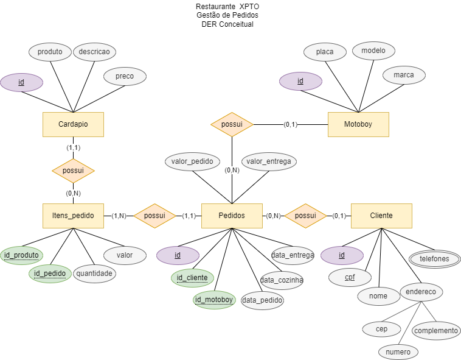
## WireFrames dos FrontEnd
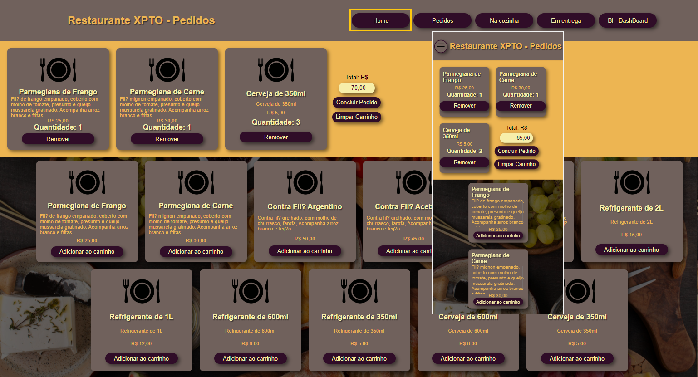
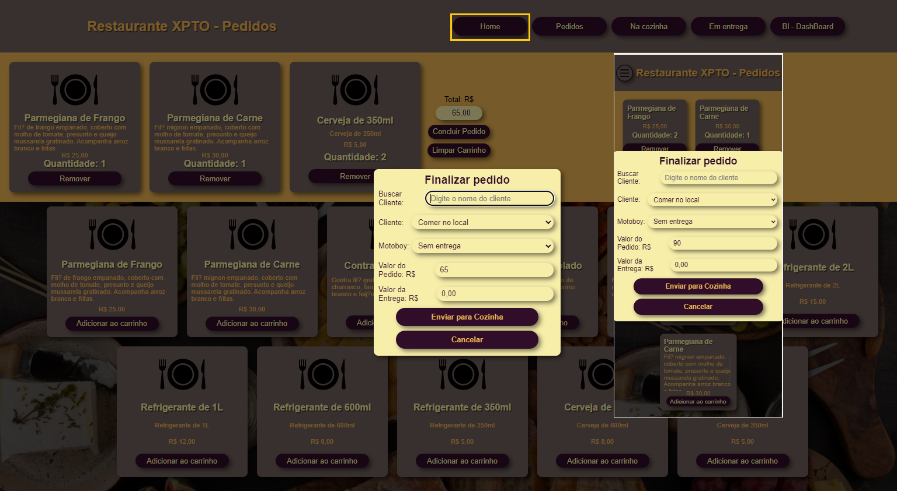
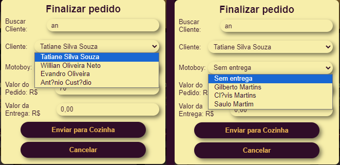
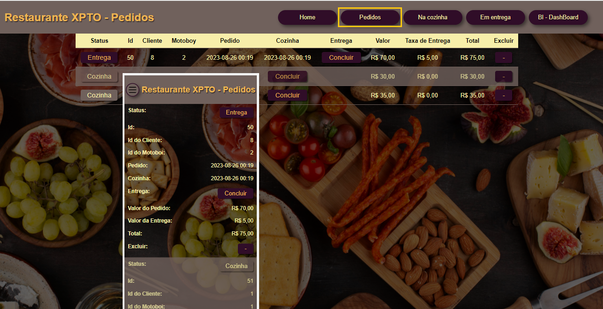
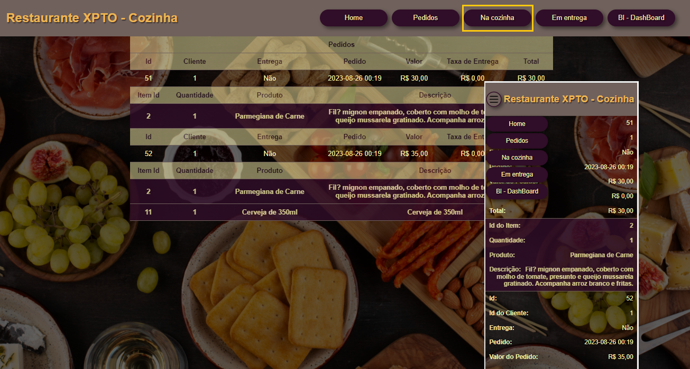
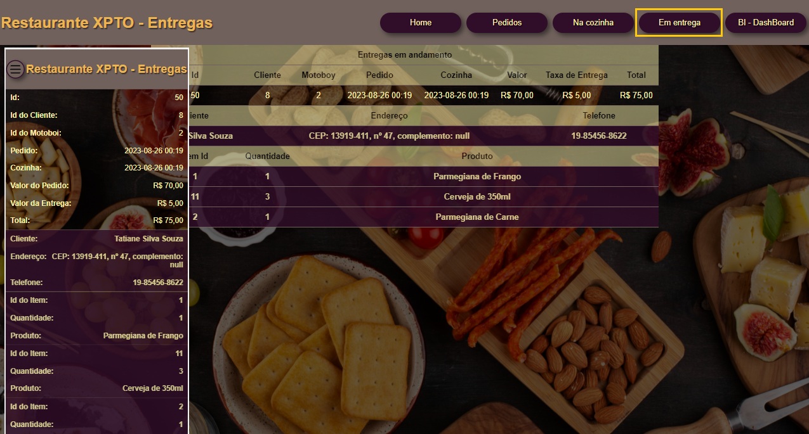
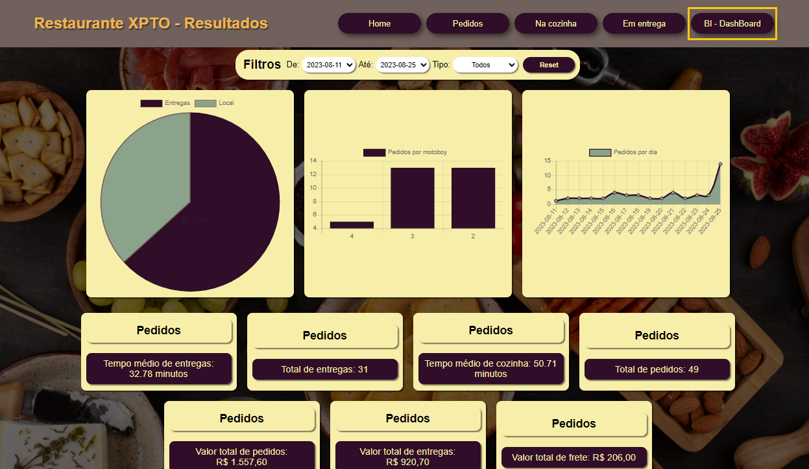
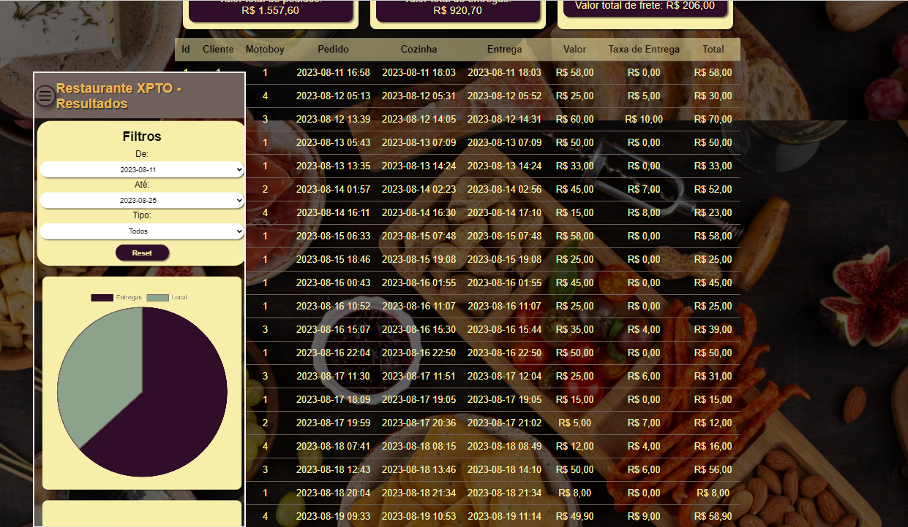
## WireFrames dos Apps
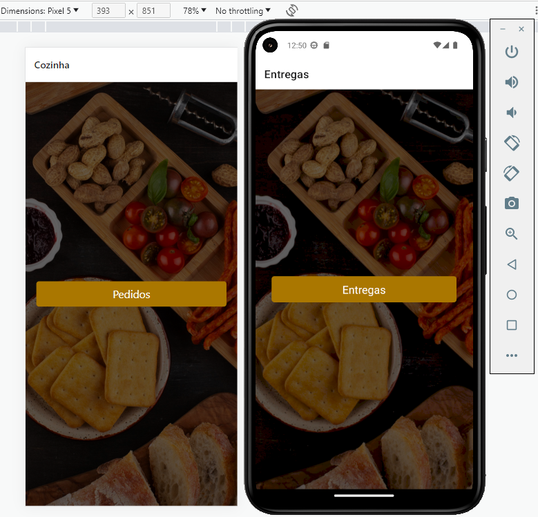
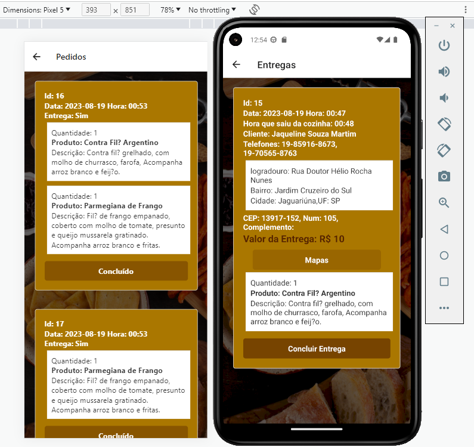
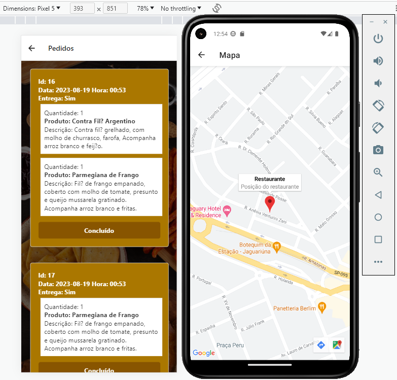
